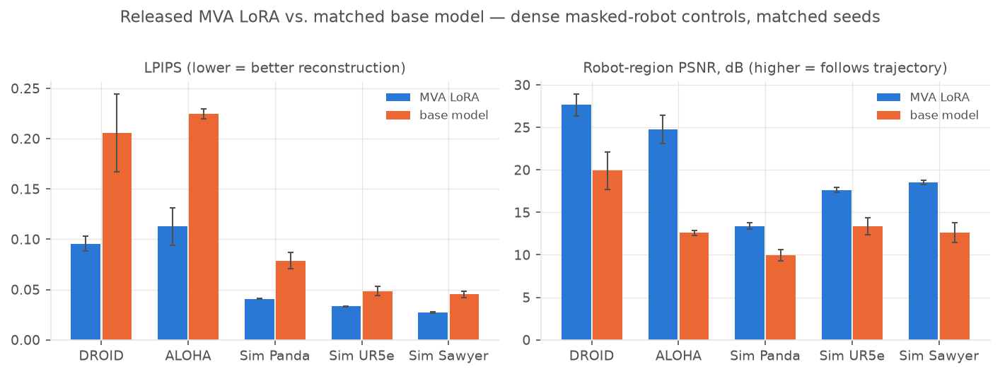
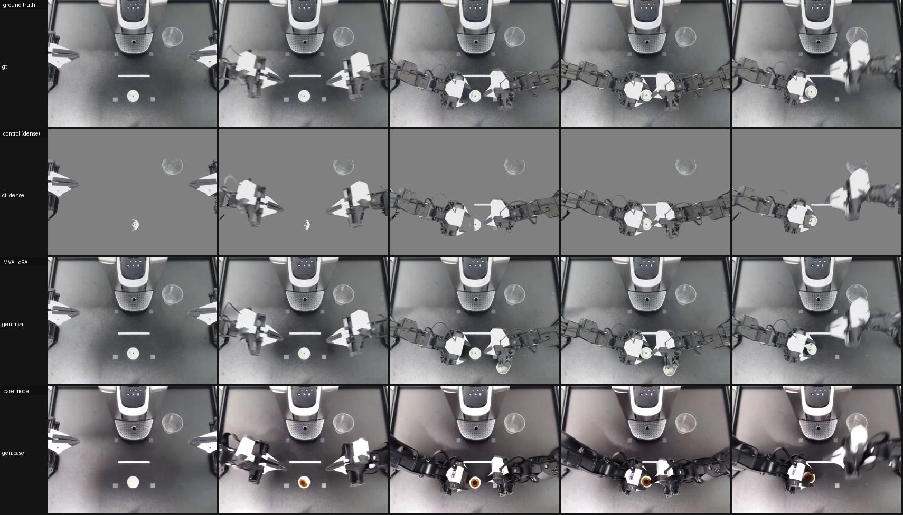
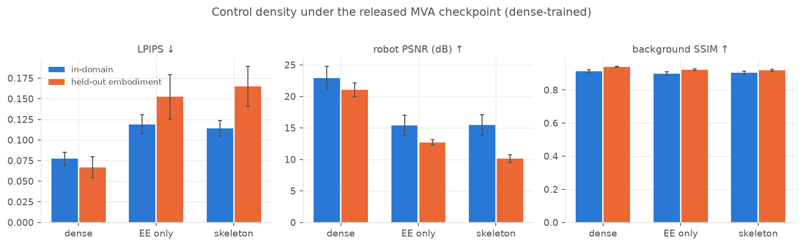
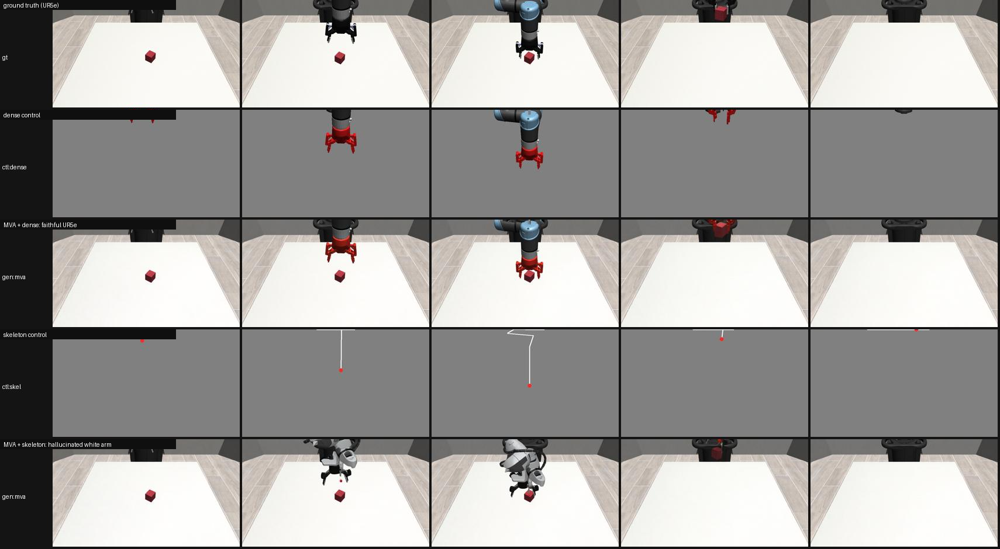
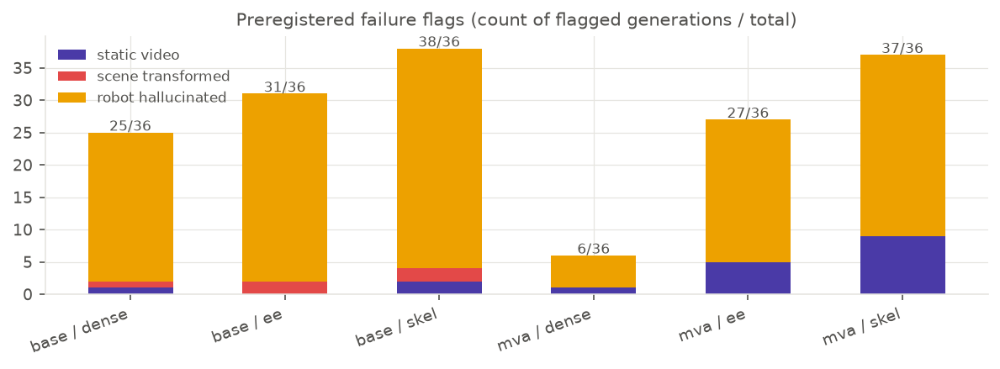

# Do masked visual actions make a video model controllable? Testing the released MVA checkpoint

**Verdict: reproduced** — for the released-checkpoint claims that are testable without the
authors' unreleased tooling. [Masked Visual Actions](https://arxiv.org/abs/2607.19343) (MVA)
proposes that the right way to tell a video model what a robot will do is to *draw the action
into pixels*: paste the robot's future trajectory, as masked robot pixels on a gray canvas, into
the model's control channel and let it inpaint the world's response. We tested the authors'
released LoRA checkpoint against its own base model, `Wan2.2-Fun-A14B-Control` (14B, two-expert
MoE), on a rebuilt public evaluation set — identical control videos, reference frames, prompts,
and noise seeds, with and without the MVA LoRAs. The LoRAs improved reconstruction and
trajectory adherence on **every subset** (36/36 clips for paired LPIPS in sim, 18/20 on real
videos), dense controls beat sparse ones, and the advantage grew — not shrank — on robot
embodiments the checkpoint never saw.

**How to read this figure.** Each bar pair is the same pretrained video model with (blue) and
without (orange) the released MVA LoRAs, generating 81-frame videos from the same dense
masked-robot control and the same seed; bars are means ± s.e.m. over clips. Left: LPIPS distance
to the ground-truth video (lower = the generation shows what actually happened). Right: PSNR
computed only on the robot's pixels (higher = the generated arm is where the control said).
MVA wins both, on real DROID (its training domain), real bimanual ALOHA (never seen in
training), and URDF-rendered simulation with in-domain (Panda) and held-out (UR5e, Sawyer) arms.

On DROID, the released checkpoint's absolute scores — LPIPS **0.096**, SSIM **0.895**, PSNR
**24.3** — land almost exactly on the paper's Table 1 (0.0945 / 0.887 / 23.74), despite our
evaluation clips being different and rebuilt from public 180p footage. We treat that closeness
as encouraging but partly coincidental; the *paired* comparisons below are the actual test.

## What the paper claims, and what we could test

The paper LoRA-finetunes a pretrained control-conditioned video model to accept dense masked
visual actions and reports: (1) high-fidelity, controllable robot video generation, beating
action- and trajectory-conditioned baselines on DROID; (2) dense visual actions beat *sparse*
visual controls (end-effector or skeleton renderings), especially off-distribution; (3) graceful
generalization to unseen embodiments, where sparse-conditioned models hallucinate or collapse.

The release contains two LoRAs (high/low-noise experts) and a thin inference script — no
rendering tools, no evaluation clips, no sparse-trained checkpoints, no robot stack. So we
tested three bounded claims: **(1)** LoRA vs base under matched conditions; **(2)**
control-density sensitivity of the released checkpoint (a proxy — the paper trained a separate
checkpoint per control type); **(3)** held-out-embodiment behavior with failures counted by
preregistered rules. Real-robot planning, policy evaluation, and inverse-dynamics action
extraction remain untested.

## Rebuilding the evaluation set from public data

Two tracks, five subsets, three control types per clip:

- **Real videos.** 16 DROID clips ([lerobot/droid_100](https://huggingface.co/datasets/lerobot/droid_100),
  Franka — the paper's training domain; 320×180 upscaled to 832×480) and 8 ALOHA clips
  ([lerobot/aloha_static_coffee](https://huggingface.co/datasets/lerobot/aloha_static_coffee), a
  bimanual rig the checkpoint never saw; 640×480). Robot masks: SAM2 video propagation from
  hand-corrected box prompts (fully automatic prompting grounded the wrong objects — see
  *Limitations*). A **preregistered sanity filter** (mask area 1–45% of frame, ≤2 empty-mask
  frames; fixed before any generation ran) excludes 4 DROID clips.
- **URDF-rendered sim.** 16 scripted robosuite (MuJoCo) pick-lift episodes with *exact* robot
  masks from segmentation renders — Panda (in-domain embodiment) plus UR5e and Sawyer (held
  out). These are the "reproducible URDF-rendered control clips": ground truth, dense robot
  render (gripper recolored red, following the paper), and sparse controls all come from the
  same simulator state.
- **Controls.** *dense* = all robot pixels on gray (the paper's interface); *ee* = only a disk
  around the end effector; *skel* = skeleton polyline + red end-effector dot (the paper's
  sparse-ablation formats).

240 evaluation videos were generated for the main comparison (2 model variants × 3 controls ×
40 clips), plus robustness re-runs with extra seeds and 50 denoising steps.

## Claim 1 — the LoRAs, not the backbone, carry the controllability

With dense controls and matched seeds, MVA beat the base model on every subset (fig. 1). Paired
per clip, MVA improves LPIPS on 34/36 real clips+sim clips combined, with robot-region PSNR gaps
of **+7.8 ± 1.2 dB** (DROID), **+12.2 ± 1.5 dB** (ALOHA), **+3.5 ± 0.9 dB** (Panda) and
**+5.1 ± 0.7 dB** (held-out sim arms). The base model is not a straw man: it is the same
control-conditioned backbone the authors finetune, and the robot pixels are plainly visible in
its control input. It usually puts *an* arm in roughly the right place — then corrupts the
gripper, warps the scene, or freezes. The LoRAs add the skill of *reading* a masked robot
trajectory as an action.

Above (bimanual ALOHA, dense control, held-out embodiment): MVA's generation is nearly
indistinguishable from ground truth; the base model darkens the scene, invents object contents,
and degrades the arms' geometry. This is the paper's claim in one image: the same backbone, the
same control video — the difference is purely the masked-visual-action adaptation.

## Claim 2 — dense beats sparse, mostly by refusing to move

Feeding the released checkpoint sparser controls degrades every metric monotonically: on DROID,
LPIPS rises from 0.096 (dense) to 0.13–0.14 and robot-region PSNR falls ~9 dB; on ALOHA the
LPIPS gap between dense and sparse more than doubles. The failure taxonomy (fig. 4) shows *how*:
with sparse controls the model increasingly emits a **static video** (motion < 30% of ground
truth: 1/36 dense → 5/36 ee → 9/36 skel under MVA). **Caveat:** the paper trained a separate
checkpoint per control type; those weren't released, so this measures the dense-trained
checkpoint's sensitivity to control density, not the paper's exact training ablation — but it
confirms the mechanism the paper credits: dense visual actions carry appearance and geometry
that sparse cues cannot.

## Claim 3 — held-out embodiments, with failures counted

The dense-control advantage is *retained and amplified* out of domain: the paired robot-PSNR gap
grows from +7.8 dB (in-domain DROID) to +12.2 dB on bimanual ALOHA, and from +3.5 dB (Panda) to
+5.1 dB on UR5e/Sawyer. And we reproduce the paper's most striking qualitative claim — that
sparse-conditioned generation "hallucinates or transforms the robot toward the training data":

On the held-out UR5e (above), the dense control produces a faithful UR5e doing the task, while
the skeleton control — same clip, same seed, same checkpoint — makes the model paint a *white
training-prior arm* over the blue-black UR5e and eventually drop the arm entirely.

By the preregistered flags, MVA-dense is nearly failure-free (1/36 static, 0 scene transforms,
5/36 robot-hallucination flags — vs 23/36 for the base model), and failures concentrate exactly
where the paper says they should: sparse controls and the base model. The robot-hallucination
threshold (robot PSNR < 14 dB) is harsh — the robot region is only 2–16% of the frame — so read
flag counts as relative rates across conditions, not absolute failure probabilities.

## Robustness checks

Re-running DROID dense with two extra seeds and with 50 denoising steps (the library default)
left the ordering and effect sizes unchanged: at 50 steps the robot-PSNR gap is +7.7 dB (vs
+7.8 dB at 40); across the two extra seeds it is +8.3 dB and +7.5 dB.

## Limitations

- Our evaluation set (36 kept clips, rebuilt from public data) is not the authors'; absolute
  numbers are not comparable to the paper's tables, even where they happen to coincide.
- DROID sources are 180p upscaled 2.6×, softening all metrics equally across conditions.
- The sparse-control comparison probes the released dense-trained checkpoint, not the paper's
  separately-trained sparse checkpoints.
- Automatic robot segmentation failed often enough (wrong object grounded, over-segmentation)
  that final masks required hand-annotated box prompts — the main practical friction in
  reproducing pixel-space control without the authors' rendering tools.
- Main runs use 30 (sim) / 40 (real) denoising steps for throughput, identically for both model
  variants; the 50-step robustness check matches the library default.

## Compute

All generation ran on the operator's **Kubernetes** cluster: 2 nodes × 8 **NVIDIA RTX PRO 6000
Blackwell** (96 GB). Peak concurrency **16 GPUs**; ~300 generated videos (81 frames, 480p,
~13.7 s per denoising step; the full two-expert pipeline fits one GPU at 69 GiB). Elapsed wall
time **4.1 h** end to end, including environment probes, weight distribution to a shared
PVC, three evaluation-set builds, six evaluation runs, and analysis.

## Experiment lineage

See the README's experiment log for branch-by-branch commands and outcomes: smoke test →
eval-set builds (real v1–v3, sim) → four primary eval runs (MVA/base × real/sim) → robustness
runs (extra seeds, 50 steps).
